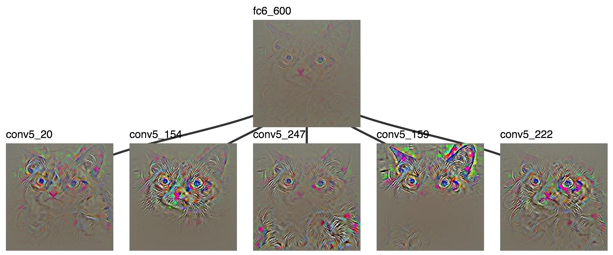
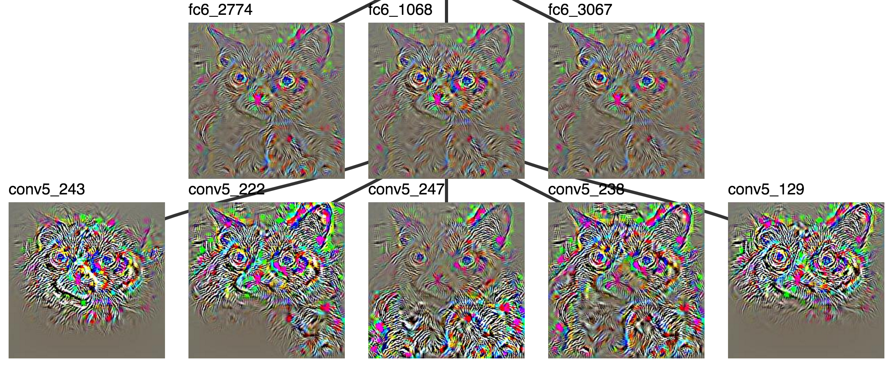
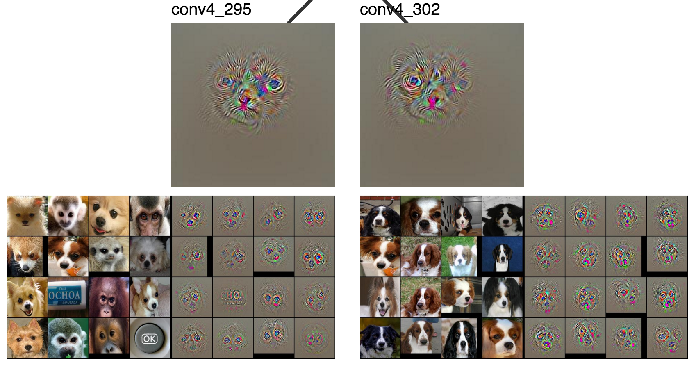
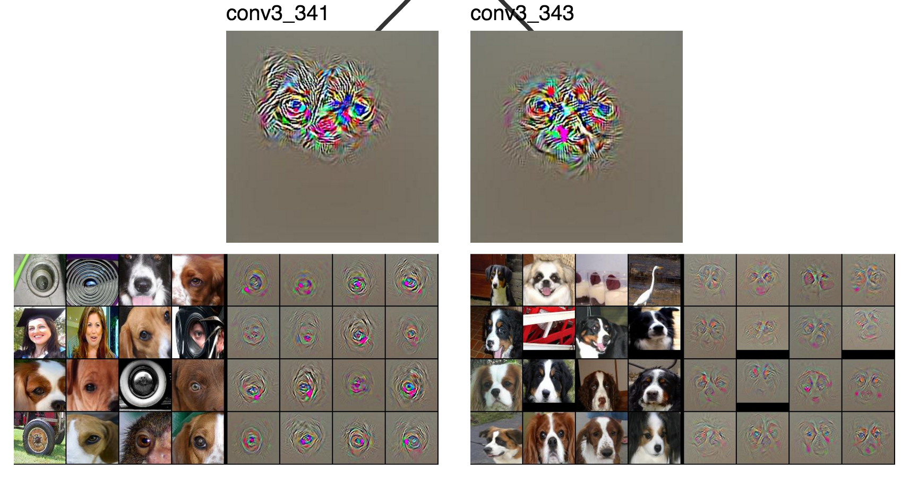
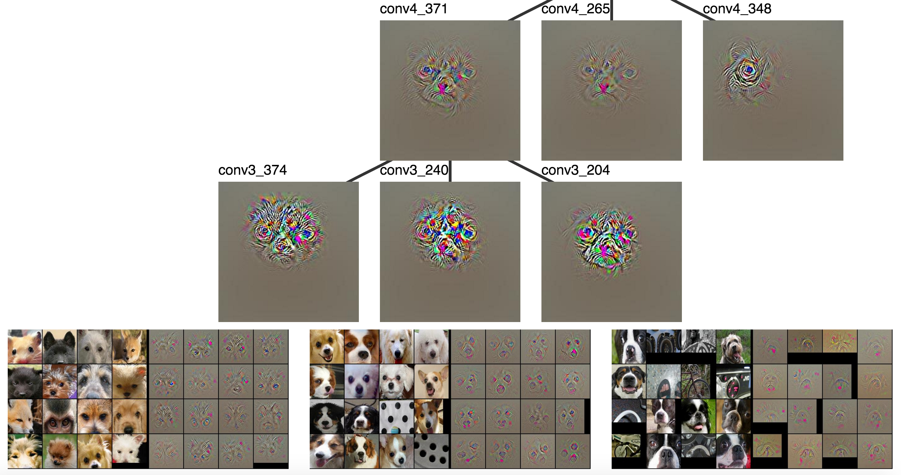
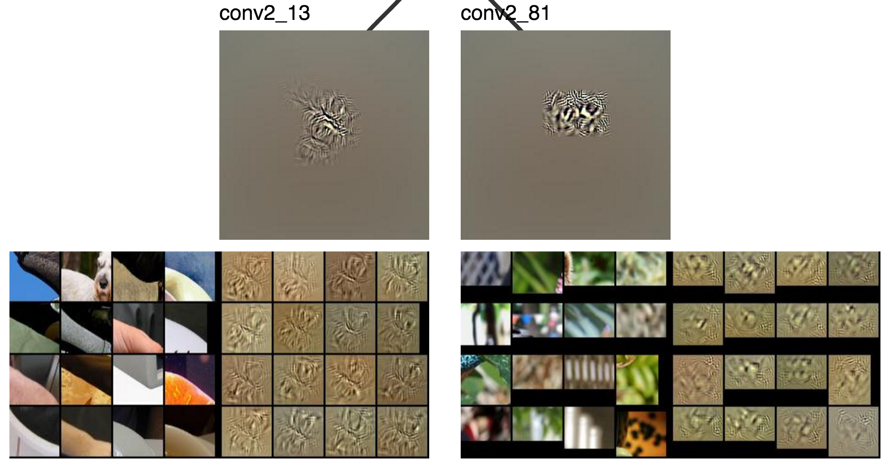
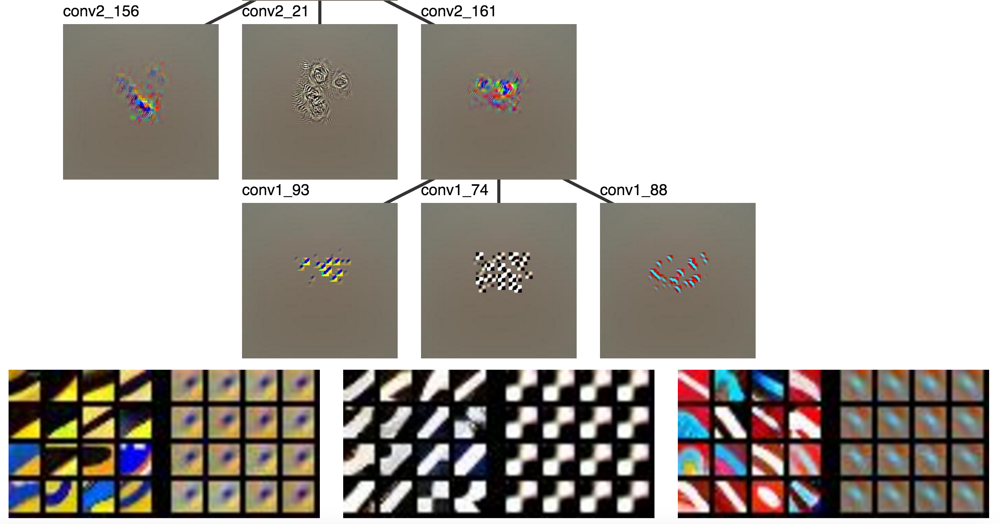

Visualizing Feature Composition
===

<figure markdown="1">
{:.center .img-responsive}
</figure>

My [last post](/why_cat/) described Convolutional Neural Networks (ConvNets)
and some obstacles to understanding them. ConvNets identify objects in images
by computing layers of features and using the last layer for object identification
rather than directly using the input. Layers closer to the input capture
low level visual concepts (e.g., edges and colors) and deeper layers capture
higher level concepts (e.g., faces). We visualized
features with "gradient" images (like the one above) which highlighted
image pixels that had a significant effect on the feature in question.
The conclusion was that ConvNets compute features that detect eyes and noses, but
there wasn't much intuition about how those eyes and noses are computed.

Here I'll introduce a visualization technique that tries to do that.
Instead of visualizing individual neurons, we'll look at how neurons
are related. A nose detector is made from a _combination of features
in the previous layer_. To understand such a composition of
features we'll relate visualizations from one layer to visualizations
of adjacent layers.

All of the code I used to produce these visualizations is available [on github](https://github.com/mcogswell/cnn_treevis)!

What's Missing from the Visualizations?
---

So far we've understood feature visualizations by explaining that they select
for either (1) concepts humans can __label__ at a __high level__ (e.g., face) or
(2) concepts that humans __relate to pixels__ (e.g., edge; __low level__).
The first occurs in deeper layers which are closer to the output and the second
occurs in shallow layers which are close the input.
We can see that middle layers of neurons might be useful because they capture
structure---certain configurations of near-by pixels that occur more than others.
But we do not have more specific intuition as for the very shallow and very deep features.
This means we can't fit the outputs (high level) and
inputs (low level) of a ConvNet together intuitively.
Even though we can relate some features in specific ways (e.g., a head should have an ear),
these examples stay within the realm of low level or high level and do not cross boundaries.
This problem is ill defined and purely one of intuition, so it's not clear what a solution
looks like, but it motivates the search for new visualization meethods.

ConvNets learn __hierarchies of features__.
Hierarchies are graphs with nodes _and_ edges, so 
to understand hierarchies we need to understand __edges__ as well as nodes.
It makes sense to visualize __relationships between features__.

One interesting visualization which already does this
is [DrawNet](http://people.csail.mit.edu/torralba/research/drawCNN/drawNet.html),
from Antonio Torralba at MIT. This is a really neat visualization, which you should
go check out (though perhaps later ;). It uses the empirical receptive fields from [this paper](http://arxiv.org/abs/1412.6856)
about emerging object detectors along with a visualization that connects individual
neurons that depend heavily on each other[^not_parcoord].
However, it's still not image specific, so it can only say how a ConvNet
would "like" to relate some parts to others instead of how a ConvNet does relate
some parts to others.

One way to Visualize the Edges
---

Our strategy will be to show single-feature visualizations from different layers
and connect them when one feature heavily influences another.
You can skip to the [examples](#some-features-in-a-hierarchy) if you want to
avoid a small bit of math.

### Edges

It would be nice to connect neurons in adjacent layers
so they are only connected when

1. both neurons detect a pattern in the input _and_
2. the ConvNet says one neuron is heavily dependent on the other.

If the first doesn't hold then we'll end up visualizing a pattern which isn't relative
to the example at hand. If the second doesn't hold then we'll relate
two features which the ConvNet does _not_ think are related.

There's a fairly natural way to do this. Consider some fully connected layer `fc7`
which produces activations $$h^7 \in \mathbb{R}^{d_7}$$ using

$$
    h^7 = \max(0, {W^{6-7}}^T h^6)
$$

Where $$h^6 \in \mathbb{R}^{d_6}$$ is the output of the previous layer and
$$W^{6-7} \in \mathbb{R}^{d_7 \times d_6}$$ is the weight matrix for layer `fc7`.
The following vector weights `fc6` features highly if they are related to
feature $$i$$ in `fc7`, satisfying (2):

$$
\partial h^7_i / \partial h^6 = 
\left\{
     \begin{array}{lr}
       W^{6-7}_i & \text{if } h^7_i > 0 \\
       0   & \text{else}
     \end{array}
   \right.\\
$$

The activation vector $$h_6$$ directly represents patterns detected in `fc6`, satisfying (1).
That means an element-wise product of the two vectors scores
features highly when they satisfy both (1) and (2), and lower otherwise:

$$
w^{6,i} = | h^6 \odot \partial h^7_i / \partial h^6 |
$$

To relate a feature in layer 7 to layer 6 we can use the top 5 indices of this
vector to select the `fc6` features to visualize. Because the
visualizations of fully-connected layers turns out to not be very informative and
because convolutional layers contribute the most to depth, we
need to be able to do this for the feature maps produced by convolutional layers.
Fortunately, the extension is simple and I'll show it using
`conv5` instead of `fc7` and `conv4` instead of `fc6`.

Instead of computing the gradient $$ \partial h^7_i / \partial h^6 $$ we'll
define a function $$f$$ and compute the gradient with respect to that function.
Specifically, let $$f: \text{feature map} \rightarrow \mathbb{R}$$ be the sum of all
pixels in an image. Then we'll compute

$$
\partial f(h^5_i) / \partial h^4
$$

where $$h^5_i$$ is a vector of all the pixels in the $$i$$th feature map
in `conv5` and $$h^4$$ is a vector of all the pixels in all chanels of `conv4`.
Then we can weight `conv4` pixels using

$$
w^{4,i} = | h^4 \odot \partial f(h^5_i) / \partial h^4 |.
$$

This is a generalization of the first approach, where there is only 1 pixel
to be summed up, so $$f$$ becomes the identity function. That means it also
extends to cases where a convolutional layer is connected to a fully-connect layer.
For details, see the code [here](https://github.com/mcogswell/cnn_treevis/blob/32db46e97c819faa098c04e5880cd00f59046781/lib/recon/reconstruct.py#L300).

Here's an example which shows the 600th `fc6` neuron in terms of the
5 `conv5` units (20, 154, 247, 159, and 222) which most contribute to it.
Hovering your mouse over the image causes it to zoom.

<figure markdown="1">
{:.center .img-responsive}
<figcaption markdown="1">
`conv5` units which most contributed to the 600th `fc6` activation
</figcaption>
</figure>
{:.zoom_img}

### Local Visualization Paths

Before showing off some more examples, I have to mention one
trick I found helpful for creating relevant visualizations.
Visualizations of type 2 applied to convolutional
layers usually set _all_ pixels but one (the highest activation)
to 0. When visualizing a unit in a convolutional
layer, say unit 44 in `conv4`, with respect to the layer above, unit 55 in `conv5`,
I could visualize unit 44 by taking a spatial max and setting all other
pixels to 0, however, that max pixel might be in a location far away from the
max pixel in unit 55, so those parts of the image might not be related and I might not be able to compare the two neurons.
To fix this I compute the gradient of unit 55 w.r.t. all units in `conv4` then
set all `conv4` _feature maps_ to 0 except unit 44. This means a local region of pixels
is visualized in unit 44 instead of a single pixel, but that local region is guaranteed
to be centered around the highly activated pixel in unit 55, so I can relate the two units[^saturate].

Some Features in a Hierarchy
---

> Why is this a cat?

<figure markdown="1">
{:.center .img-responsive}
</figure>

Well... the highest `fc8` activation is unit 284, which means "Siamese cat".
[Grumpy Cat](https://en.wikipedia.org/wiki/Grumpy_Cat) turns out to be a Snowshoe Siamese according
to Wikipedia and the ILSVRC doesn't have "Snowshoe Siamese". Let's start at `fc8_284`.

<figure markdown="1">
{:.center .img-responsive}
<figcaption markdown="1">
The "Siamese cat" neuron (`fc8_284`) along with units that highly activated it in `fc7`
and units that highly activated `fc7_4032` in `fc6`.
</figcaption>
</figure>
{:.zoom_img}

Unfortunately, these don't seem very interpretable, probably because these
layers have no spatial resolution. That means we can't really relate classes
to pixels. However, the convolutional layers tell a different story. `conv5`
starts with high level interpretable features which we understand as cat
parts, so maybe we'll be able to almost relate ConvNet outputs to inputs.

The `conv5` visualizations rooted in `fc8` were
quite saturated, so let's start with a visualization rooted at `fc6_1068`.

{::comment}
interesting paths
fc8_284 -> fc7_1757 -> fc6_3354
fc8_284 -> fc7_4032 -> fc6_1068
{:/comment}

<figure markdown="1">
{:.center .img-responsive}
<figcaption markdown="1">
A highly activated `fc6` unit and the `conv5` units which most contributed to it.
</figcaption>
</figure>
{:.zoom_img}

Some units in `conv5` are looking for faces. Some units are looking
for ears. The visualized units of `conv5` which contribute to `fc6_1068`
seem to look for different parts of the cat which happen to show up in
different locations.

It becomes easier to tell what's going on once the patch
visualizations are added, but it's hard to fit all 5 on the same
screen, so let's set aside two of them.
These are looking for wheels (they look like eyes) and generic animal faces (lots and lots of
conv5 activations look for some sort of animal face).

<figure markdown="1">
{:.center .img-responsive}
<figcaption markdown="1">
</figcaption>
`conv5_238` and `conv5_222`
</figure>
{:.zoom_img}

Now we can focus on more interesting neurons.

<figure markdown="1">
{:.center .img-responsive}
<figcaption markdown="1">
As shown previously, `conv5_129`, `conv5_247`, and `conv5_243`.
</figcaption>
</figure>
{:.zoom_img}

Clearly `conv5_129` is looking for eyes, `conv5_247` seems to be looking
at furry stuff, and `conv5_243` is looking for dog faces.
Those are high level categories that could clearly contribute
to classifying Grumpy Cat as a cat.

> furr + face + eye (perhaps tire) + ... = cat

Let's continue to `conv4` to see what makes up a dog face.
Again, we'll discard two neurons

<figure markdown="1">
{:.center .img-responsive}
<figcaption markdown="1">
`conv4_295` and `conv4_302`
</figcaption>
</figure>
{:.zoom_img}

and keep the rest.

<figure markdown="1">
{:.center .img-responsive}
<figcaption markdown="1">
`conv4_371`, `conv4_265`, and `conv4_348`
</figcaption>
</figure>
{:.zoom_img}

There are lots face detectors (even in `conv4`!), some sort of pattern
that seems to find noses (`conv4_265`), and another eye detector.
I didn't try to find the redundant face and eye detectors, they
just seem to occur quite frequently. There's also a noticable difference in the amount
of complexity and context around the eyes and faces, with more complexity and
context in deeper layers.

> dog faces + nose + eye + ... = dog face

I'm still interested in faces, so let's look at `conv4_371`.
We'll throw out 2 neurons

<figure markdown="1">
{:.center .img-responsive}
<figcaption markdown="1">
`conv3_341` and `conv3_343`
</figcaption>
</figure>
{:.zoom_img}

and keep the rest.

<figure markdown="1">
{:.center .img-responsive}
<figcaption markdown="1">
`conv3_374`, `conv3_240`, and `conv3_204`
</figcaption>
</figure>
{:.zoom_img}

We got rid of a simple eye detector and a vertical white line / face detectors and kept some more interesting features.
`conv3_374` looks for fur and eyes together, `conv3_240` looks for two eyes and a nose, and `conv3_204`
looks for a snout with a pink thing (tongue) underneath it.

> face + eye + `conv3_374` + `conv3_240` + `conv3_204` + ... = dog face

Clearly `conv3_374`, `conv3_240`, and `conv3_204` are somewhat well defined parts,
but it's hard to name them.

We'll continue with `conv3_240`.

<figure markdown="1">
{:.center .img-responsive}
<figcaption markdown="1">
`conv2_13` and `conv2_81`
</figcaption>
</figure>
{:.zoom_img}

The left neuron (`conv2_13`) sort of looks like it activated
for the cat's cheek, but I can't quite tell what the right one does.
These are clearly lower level than `conv3`, where there was still
a simple eye detector and a simple face detector.

<figure markdown="1">
{:.center .img-responsive}
<figcaption markdown="1">
`conv2_156`, `conv2_21`, and `conv2_161`
</figcaption>
</figure>
{:.zoom_img}

I can see how `conv2_161` and `conv2_21` might be combined to create an eye detector
where the first looks for insides of eyes and the second looks for outlines. `conv2_156`
might also be used for noses, but it's not a very strong connection.

> dark black rectangular blob (nose) + circle outline (eye part 1) + small dot (eye part 2) + ... = 2 eyes + nose

Finally, we visualize `conv1`, which looks for straightforward motifs
like the classic Gabor filters.

<figure markdown="1">
{:.center .img-responsive}
<figcaption markdown="1">
`conv1_93`, `conv1_74`, and `conv1_88`
</figcaption>
</figure>
{:.zoom_img}

> circular blob + black and white grid + colored edge + ... = small dot

The visualizations sort of answered why the CNN called the image a cat.
The concepts represented by a neuron's visualization and
that of its parent typically fit together well. You can see how one is
composed of the other. However, the visualizations, our capacity to understand
them, or the network breaks down at some point.

Another interesting observation
is the amount of redundancy between layers. For example, multiple layers seem to contain
more than one face detector. It could be that the visualizations aren't good
enough to distinguish between features that really are different, that the network
really learns redundant features, or that humans could do a better job at
seeing the differences. Some of my [recent work](http://arxiv.org/abs/1511.06068)
suggests the networks do learn significantly redundant features, so the models
could be at fault.

Conclusion
---

In this post I explored how we understand ConvNets through visualization.
We tend to focus on individual neurons, but not how they relate to other neurons.
The latter part is essential because ConvNets are supposed work by learning to
compose complex features from simpler ones. The second part of the blog proposed a
way to combine existing visualizations in a way that relates units across layes
in a neural network. These visualizations offer some insight into relations
between features in adjacent layers, but this is only a small step toward a better
understanding of ConvNets.

{::comment}
The redundancy is much more prevelant with this method because redundant features
tend to simultaneously be top activations.
It may have been present before, though not noticable to the same degree

It would be nice if all the reconstruction patches were not pictures of dogs.
Visualizations of a CNN trained with more visually balanced classes
might help.

how to focus visualizations on fine grained classification?

I've been talking about how to understand images.

why redundancy? -- possibly because of the fine grained dog classes

* conclusion
    * talk about ways to know how a thing works... contrast intuitions and mathematical understanding... one preceeds the other
    * talk about being able to understand ConvNets vs being able to understand 
        * perhaps we understood HOG better, but somehow we can understand ConvNets better because it more closely maps to our visual system

One cool thing about ConvNets is that __there is complexity__ and we
can try to understand it, especially if we enlist the aid of human vision through visualization.
This is not at all the case for Deep Blue.
That program worked by approximately enumerating possible chess games
many moves away (there are lots, so this is hard) and applying some
algorithmic and heursitic tricks so it could enumerate fewer.
When humans play chess we mainly look for patterns and can make only
extremely limited progress trying to consider all possible future moves.

and it might even be close to how we understand the visual world (it discovers parts and we tried to describe the world in parts).

still don't know how to relate fc8 to fc6

Points to make / Questions to ask
---

* Why do we need to modify the backward step to get better visualizations?

* There might be other ways than the weight matrix method to relate
  neurons to eachother, also ways to relate sets of neurons.

* There are probably much better ways to visualize this information,
  but I just wanted to do a simple visualization here.

* Maybe we can begin to answer questions like
  "What makes this dog detector different from this other dog detector?"

* It's clear that the hierarchy of parts that makes up the eye detector
  decreases in "semantic complexity" from layer to layer; one layer
  is clearly simpler than the one above it.

* Is my cropping method similar to the "empirical recptive fields" of the
  emerging detectors paper?

* Note that I'm not (yet) talking about relating spatial location.

* Note that the software I wrote doesn't just have to consider weights
  between adjacent layers, it can weight any pair of layers (just using
  gradients from a fixed starting point).

* I need to make a point about how good examples drive new ideas. (cite Bostock's talk?...)

* Interface between conv5 and fc6

* point out that my description of a cat could also be a dog

* End by talking about how this is a qualitative intuitive understanding of the thing.
  That's the worst type of understanding for a scientist... we would like something
  quantitative, probably mathematical. However, often those things are inspired by
  qualitative understanding like visualizations can provide.

* At some point mention that the hierarchy of parts intuition is how neural net
  people always describe their models.

* It would be cool if someone took these concrete examples and was able to
  implement a vision system without learning.

* This allows us to look at patterns networks detect which we find very difficult
  to talk about and name.

P.S.: it comes with code (TODO)

TODO: thank yous

More Examples
---

Here are a couple more interesting relations.

{:.center .img-responsive}
{:.zoom_img}

{:/comment}

[^nn_intro]:
    Andrej Karpathy's recent [blog](http://karpathy.github.io/2015/10/25/selfie/) is a blog length introduction
    ConvNets for a wide audience. Also see [this](https://www.youtube.com/watch?v=bHvf7Tagt18)
    introduction to Machine Learning and Deep Learning from Google.

    For more technical details on NNs and ConvNets, try Michael Neilsen's [book](http://neuralnetworksanddeeplearning.com/),
    Andrej Karpathy's code oriented [guide](http://karpathy.github.io/neuralnets/), or 
    one of Chris Olah's [blogs about ConvNets](http://colah.github.io/posts/2014-07-Conv-Nets-Modular/).
    Pat Winston also has a [lecture about neural networks](https://www.youtube.com/watch?v=q0pm3BrIUFo) in his
    intro Artificial Intelligence course.

    I learned the basics from Andrew Ng's Coursera [course](https://www.coursera.org/learn/machine-learning) on Machine Learning
    and Geoffrey Hinton's [course](https://www.coursera.org/course/neuralnets) that dives a bit deeper into Neural Networks.

[^nn_diagram]: This image comes from [chapter 1](http://neuralnetworksanddeeplearning.com/chap1.html) of
    Neural Networks and Deep Learning (Michael Neilsen's book).

[^categories]: Since the network was trained on the [ILSVRC classes](http://image-net.org/challenges/LSVRC/2014/browse-synsets)
    there are actually many subcategories for both dogs and cats.

[^winston_vision]: Pat Winston has a nice [video](https://www.youtube.com/watch?v=gvmfbePC2pc) about
    one such attempt to hard code an algorithm for vision.

[^other_vis]: You can find how some other cool

    You may also have heard of [Google's](http://googleresearch.blogspot.com/2015/06/inceptionism-going-deeper-into-neural.html)
    [DeepDream](https://www.reddit.com/r/deepdream/).
    This can be thought of as an image specific combination of the two
    ideas that does a sort of optimization starting from a real image,
    but meant to maximize a set of neurons instead of just one and applied to
    different layers instead of just the output layer.

    Another cool visualization tool is Jason Yosinski's [deepvis](http://yosinski.com/deepvis),
    which uses a lot of the aforementioned techniques in one visualization tool.

[^not_parcoord]: It looks like [parallel coordinates](https://syntagmatic.github.io/parallel-coordinates/),
    but it's not really. The axes correspond layers of a CNN and the values on
    each axis correspond to individual neurons. Placing neurons on an axis implies
    an order (e.g., neuron 5 is greater than neuron 88), but no such ordering of
    neurons in the same layer exists.

[^saturate]: This tends to saturate visualizations, especially as they
    grow further from the root activation. I couldn't find simple rule that consistently
    prevented saturating, but I found the saturated versions still work work well enough.
    Let me know if you come up with something.

{::comment}

Examples
---
TODO: include examples of other types of things
license plate and text detection
http://werbos.ece.vt.edu:5000/vis/COCO_train2014_000000359320.jpg?blob_name=conv5&act_id=243

detected tree as legs in elephant picture
http://werbos.ece.vt.edu:5000/vis/ILSVRC2012_val_00033331.JPEG?blob_name=conv5&act_id=169

cat pointy ear conv5 blob
http://werbos.ece.vt.edu:5000/vis/cat.jpg?blob_name=conv5&act_id=159
conv5_159 -> conv4_356 -> conv3_228 (upper left ear) and conv3_227 (lower right ear)
{:/comment}

{::options parse_block_html="true" /}
