Why is this a cat?
===

<figure markdown="1">
{:.center}
</figure>

In other words, "How do you recognize this cat?".
Actually, I'm not so interested in how _you_ see, but rather how
_computers_ see, because they've gotten a lot better at seeing
and we don't fully understand how they do it.
For those coming to this blog who don't know, Convolutional Neural
Networks are the models that have allowed computers to do reasonably
well at a wide variety of visual tasks.
There are some intuitions about how ConvNets work, but it can be hard
to find examples of the intuitions, so I'll try to do that
using some cool visualization techniques.

{::comment}
* about CNNs (short)
    * the really important thing to understand at a high level is layers of transformation and nodes at each layer
* explain the ZF visualizations and the extension by the striving for simplicity paper
{:/comment}

(Convolutional) Neural Networks -- Building Layers of Patterns
---

Others have done quite a good job of introducing Neural Networks (NNs) and Convolution Neural Networks (ConvNets),
so I won't spend much time on that.
You can find a variety of pointers in the footnote at the end of this sentence[^nn_intro].
However, I'll still try to introduce some
important concepts as I go along.

Though they've been around [since the '80s](https://en.wikipedia.org/wiki/Convolutional_neural_network#History),
ConvNets became really popular after faster computers and more data allowed them to win the ImageNet
Large Scale Visual Recognition Challenge in 2012.
Since then, this type of model has gone from obscure to a fundamental part of Computer Vision.
We've discovered they're pretty good at a lot more than telling you that an image contains a cat.

ConvNets transform an input (the cat image)
in multiple steps represented as layers. The first layer, the input, corresponds to image pixels
and the last layer, the output, has one number for each thing the image might contain (here, the
1000 [classes from the ILSVRC 2012 challenge](http://image-net.org/challenges/LSVRC/2014/browse-synsets)).
Each layer looks for patterns in its input, transforming them into new outputs
where higher layers look for more complex patterns until the final layer produces
outputs that correspond to whatever you're interested in (i.e., it labels the image a cat).

A useful way to think of a neural network in terms of the nodes -- called units or neurons --
looking for or trying to detect patterns.
Below is a network with 4 layers, each containing some nodes (though the input nodes aren't
shown). On the left is the input with 5 nodes and on the right is the output with 1 node.
The first hidden (middle) layer contains 3 nodes and the 2nd has 4.

<figure markdown="1">
{:.center}
<figcaption markdown="1">
A simple Neural Network with 4 layers (including input and output).[^nn_diagram]
</figcaption>
</figure>

In normal neural networks each unit corresponds to a single number, but
in ConvNets they correspond to images. The network we'll be using (AlexNet) has
9 layers (0 through 8) and each layer has hundreds of neurons. This scale
(many layers, many neurons) is important for understanding images well.

The important bit for this article is the connections between units.
Each unit is connected to all the
units in the previous layer because it's searching for patterns in those units.
Since there are layers of these, deeper (toward the output) units are
looking at patterns of patterns of patterns....
so each unit depends on the ones that came before it in a hierarchical fashion.
The __hierarchies of neurons__ allow efficient
representation of complex patterns in terms of simpler patterns.

Something to Understand
---

Crucially, the patterns in these systems are learned from examples,
and this is where our understanding of the system starts to fail.
To train a ConvNet, we show it hundreds of thousands of cats, dogs,
boats, birds, etc. and adjust the patterns seen by neurons at all layers
so that the last layer says cat when the image contains a cat and not otherwise[^categories].
This ability to get working system
with only a vague specification makes the model possible, but it
also means we sacrifice some understanding.
In one sense I understand exactly
how the CNN works because I can implement them in code and train it
to make good predictions. In another sense I have no idea
how the thing works because __I don't know what patterns it's looking for__.

An interesting thing about ConvNets is that there are even small bits
we might be able to understand in the first place.
Consider [Deep Blue](https://en.wikipedia.org/wiki/Deep_Blue_(chess_computer)),
IBM's program which famously beat the reigning world champion at chess.
At some point a team of programmers coded the thing up, so they clearly know
[how Deep Blue works](http://stanford.edu/~cpiech/cs221/apps/deepBlue.html).
However, a similar problem to the CNN problem appears. If you ask one of
the programmers to tell you why the machine made a particular move
she can't tell you in a way that fits into the understanding of
even the most seasoned chess player.

There aren't any patterns to understand. When asked
to make a move, Deep Blue searches
through all possible future moves and has some rules to help it pick
the best. There are a few nice algorithmic tricks and well chosen rules
that allowed it to perform as well as it did, but the method doesn't
fit into any human framework of understanding.

On the other hand, humans can describe, and even teach how they play chess.
It's harder to describe how we see.

> Why is this a cat?

<figure markdown="1">
{:.center}
</figure>

Here's my answer:

> The thing in the center has __eyes__, a __flat, pink nose__, and a __small mouth__.
> It also has __pointy ears__ which compose with the previous features
> to form a __head__ with __ears on top__ and __mouth on the bottom__.
> Furthermore, it has __whiskers__, and is quite __furry__.
> Its expression is amusing, but has little to do with it being a cat.

That's a start, but it isn't precise enough.
I can't use it to write an algorithm that sees because
the description isn't in terms of any useful input.
I don't (nor do computers) have a furry sense, an ear sense, or a mouth
sense -- that's what vision gives me --
yet I described what I see in terms of those fundamental components.
It would be useful if I could recursively describe each of these
parts in further detail until each complex visual pattern is __detailed in terms of the input__.

Evidence suggests this is at least _very hard_. Computer Vision is the name
of the field which has been trying to do it for decades. Come up with a candidate description,
test it by implementing it on a computer, fail, repeat[^winston_vision].

However, ConvNets seem to be able to do it, so let's try to understand them.

Visualizing Individual Units
---

Especially since the ILSVRC challenge in 2012, lots of methods have been
proposed to understand the patterns learned by ConvNets.
The kind of understanding I'm interested in is an intuitive understanding
of why a ConvNet makes a particular choice. It's hard to describe how we
see in words, but it seems even more futile for ConvNets.
However, our precise computational understanding of ConvNets allows us
to generate images with certain specific meanings. Fortunately, our visual
system can often understand these visualizations and thereby
understand something about ConvNets.

The next part gets researchy, so feel free to skip it.
All you need to know is that we can generate images which highlight
the pixels a particular neuron cares about so that changing those
pixels in the original image would greatly effect the neuron's activation,
but changing other pixels wouldn't have such a great effect.
Thus visualizations relate neurons to pixel space.
Make sure you visit the [examples](#examples) section to get an
idea of what the visualizations mean, because that's the next step.

### Ways to Visualize ConvNets

There are two ways to generate visualizations:

1. __Optimization in Image Space__ (uses gradients)

    Training a CNN is just adjusting the _patterns_ (free variables) neurons look for
    in _images_ (fixed variables) so the neurons become more and more likely to
    associate the patterns of a cat image with the label "cat".
    Instead, this visualization method leaves _patterns_ alone (fixed variables)
    and adjusts _images_ (free variables) so the neurons are more and more likely to see the patterns
    they want to call "cat".
    Note that these methods start with a blank image and optimize from there instead
    of starting with a real image and perturbing it, so these techniques are
    __not image specific__. They simply ask "What image would the CNN like to see?"
    {::comment}
    (TODO: Is it just adversarial examples when you start with an image?)
    {:/comment}

    Simonyan, Vedaldi, and Zisserman have done some [nice work](http://arxiv.org/abs/1312.6034)
    with this method, as have [Mahendran and Vedaldi](http://arxiv.org/abs/1412.0035).
    Some earlier work was done by [Erhan et. al.](http://www.iro.umontreal.ca/~lisa/publications2/index.php/attachments/single/207)
    Here's a visualization which was generated to maximize the a flamingo recognizing neuron using
    this method. You can clearly see "flamingo elements".

    <figure markdown="1">
    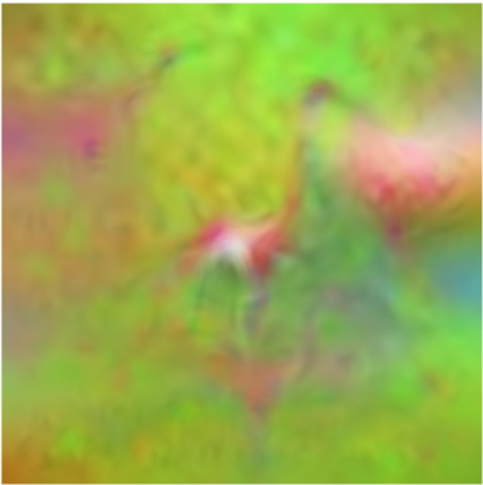{:.center}{: style="width: 50%"}
    <figcaption markdown="1">
    From figure 8 of [[Mahendran and Vedaldi](http://arxiv.org/abs/1412.0035)].
    </figcaption>
    </figure>

2. __Gradients__ (just gradients, sort of)

    Another technique tries to show how changing certain pixels
    will change a desired neuron (again, e.g., a neuron trained to recognize cats)
    That is, it just visualizes the gradient
    of a particular neuron with respect to the image. This
    technique __is image specific__. It asks "Which pixels in this one particular
    picture made the cat activation high?"

    Actually, I lied. Visualizing the pure image gradients generates is not very satisfying,
    as shown in Simonyan, Vedaldi, and Zisserman [paper](http://arxiv.org/abs/1312.6034).
    Zeiler and Fergus created a "deconv" visualization which is mathematically similar to the gradient image,
    but uses a slightly different function to compute the backward pass of the
    ReLU (explained in [Simonyan, Vedaldi, and Zisserman](http://arxiv.org/abs/1312.6034)
    and quite clearly in the [guided backprop paper](http://arxiv.org/abs/1412.6806)).

    [Deconv visualizations](http://arxiv.org/abs/1311.2901) by Zeiler and Fergus were the first to figure out this method.
    A more [recent extension](http://arxiv.org/abs/1412.6806) by Springenberg, Dosovitskiy, Brox, and Riedmiller
    is called guided bakprop. It refines the idea and makes it work for fully connected
    layers (at least those in AlexNet) by adding another restriction to
    the backward pass of the ReLU unit (again, their paper has an excellent explanation).
    In contrast to the first type of visualization, these methods focus on intermediate layers
    and individual neurons rather than output layers and the ConvNet as a whole.

The second method because allows questions about __specific images__
and __specific neurons__, so we'll use it; specifically, we'll use guided backprop.
There are some other cool techniques you can read about in the
footnote at the end of this sentence[^other_vis].

### Examples

Now let's use guided backprop to visualize a couple neurons in different layers.
Here are visualizations of neurons 4 and 65 from
layer `conv1` (after the ReLU, but not after pooling):

<figure markdown="1">
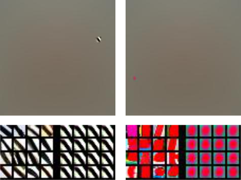{:.center}
<figcaption markdown="1">
`conv1_4` and `conv1_65`
</figcaption>
</figure>
{:.zoom_img}

The top of each side contains one of the "gradient" images the
method produces, which means that changing the non-gray pixels
in the original image will likely raise the activation of the corresponding neuron (`conv1_4` or `conv_65`).
It's sometimes hard
to figure out exactly what about the highlighted pixels the CNN
responds to. One good way to do it is to look at
"gradient" patches in other images which highly activate the same neuron, so
on the left of the bottom images are these patches cropped from
their images (taken from the ILSVRC 2012 validation set). On the
right are the corresponding "gradient" image patches (black diagonals
and red blobs; cropped from the whole gradient image). As you might
already know, `conv1` learns to look for
simple features which are easy to relate pixels; e.g., oriented edges and colored blobs.

If you're familiar with the type 2 visualizations from previous section then
you might wonder why these visualizations are much larger and mostly gray.
Typically the non-gray section is cropped out of the gray because the gray sections
have 0 gradient and are uninformative, as in the bottom part of the visualization.
To keep later in mind I leave the whole image intact, which means it's mostly
gray and insignificant, but location information is preserved.

<figure markdown="1">
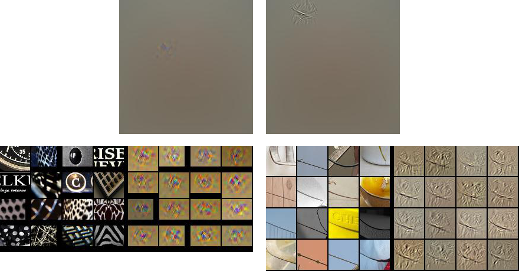{:.center}
<figcaption markdown="1">
`conv2_174` and `conv2_69`
</figcaption>
</figure>
{:.zoom_img}

`conv2` is a bit less straightforward to understand than `conv1`.
It's hard to say what the neuron on the left seems to be looking for.
Perhaps it's a black or white background with some sort of clutter from
the other color. I don't know how this contributes to recognition of ILSVRC
object classes and it's hard to find a rule that directly relates it to image pixels,
but that doesn't mean it's useless. Unit 69 is clearly looking for mostly horizontal
lines that go up slightly to the left. It's nice that the unit is invariant to
context (shower tiles, arm band, bowl), but I still have trouble relating it to
object classes and I'm not sure how the fuzzy bits around the line in the gradient
images relate to pixels.

<figure markdown="1">
{:.center}
<figcaption markdown="1">
`conv5_137` and `conv4_269`
</figcaption>
</figure>
{:.zoom_img}

Deeper layers capture more abstract concepts like the beak
of a bird (`conv5_137`), which also activates highly
in response to Grumpy Cat's nose. Certain features like `conv4_269`
respond to specific patterns which are clearly at a larger scale
than `conv1` or `conv2`, but it's hard to identify
exactly how they might be useful. It's hard to come up with a rule to
extract either pattern from pixels.

What the Visualizations Don't Say
---

In each example it was easy to understand the neurons in input/pixel space (e.g., `conv1_4` is an edge filter),
easy to understand the neurons in output space (e.g., `conv5_137` should probably fire for birds), or
it was hard to understand the neurons in either space (e.g., `conv2_174`).
These visualizations are nice, but the inability to understand one neuron in terms of input or output
prevents us from understand ConvNets see, how they connect input to output.
To be more specific,

1. These visualizations _can_ sometimes confirm (qualitatively) that particular neurons
   select for concepts humans can label or for concepts that humans can connect directly to pixel space.

2. The first interpretation is limited to certain high level neurons.
   We can see that middle layers of neurons might be useful, but we don't
   really know why. They need to be related in specific ways to either
   the gabor filters or the high level object parts, but we can't identify those ways.

3. Even though we can relate some things in specific ways (e.g., a head should have an ear)
   we don't know for sure that the CNN is doing that (though it's a pretty reasonable guess :).
   However, it could also be relating unknown parts in strange or (if you want to go that far) unwanted ways.
   These visualizations don't say that the head is made up of pointy ears, a pink nose, whiskers, etc.

These relationships are a fundamental part of ConvNets.
They learn __hierarchies of features__.
Hierarchies are graphs with nodes _and_ edges.
To understand hierarchies we need to talk about the edges.

The one thing I know which does this
is [DrawNet](http://people.csail.mit.edu/torralba/research/drawCNN/drawNet.html),
from Antonio Torralba at MIT. This is a really neat visualization, which you should
go check out (though perhaps later ;). It uses the empirical receptive fields from [this paper](http://arxiv.org/abs/1412.6856)
about emerging object detectors along with a visualization that connects individual
neurons that depend heavily on each other[^not_parcoord].
However, it's still not image specific, so it can only say how a ConvNet
would like to relate some parts to others without even knowing which neurons
are likely to fire together.

One way to Visualize the Edges
---

This is another slightly technical section that tries to relate
neurons in adjacent layers so we can visualize them together.
Skip to the [examples](#some-features-in-a-hierarchy) if you want.

### Edges

To get a hierarchy for Grumpy Cat we need a way to connect neurons in adjacent layers
so they are only connected when (1) both neurons detect a pattern in the input
_and_ (2) the ConvNet says one neuron is heavily dependent on the other.
If the first doesn't hold then we'll end up visualizing two units which didn't
actually find any patterns in the input. If the second doesn't hold then we'll relate
two neurons which the ConvNet doesn't think are actually related.

There's a fairly natural way to do this. Consider some fully connected layer `fc7`
which produces activations $$h^7 \in \mathbb{R}^{d_7}$$ using

$$
    h^7 = \max(0, {W^{6-7}}^T h^6)
$$

Where $$h^6 \in \mathbb{R}^{d_6}$$ is the output of the previous layer and
$$W^{6-7} \in \mathbb{R}^{d_7 \times d_6}$$ is the weight matrix for `fc7`.
The following gradient weights `fc6` in terms of what makes the ConvNet happy, satisfying (2).

$$
\partial h^7_i / \partial h^6 = 
\left\{
     \begin{array}{lr}
       W^{6-7}_i & \text{if } h^7_i > 0 \\
       0   & \text{else}
     \end{array}
   \right.\\
$$

The activation vector $$h_6$$ directly represents patterns detected in `fc6`, satisfying (1).
Thus, the absolute value of an element-wise product of the two vectors determines which
neurons in `fc6` activated $$h^7_i$$.

$$
w^{6,i} = | h^6 \odot \partial h^7_i / \partial h^6 |
$$

In the following examples we'll use the top 5 indices of this vector to select examples to visualize
in relation to $$h^7_i$$.

To deal with feature maps (e.g., `conv5` to `conv4`),
compute the gradient feature maps in `conv4` and multiply them with the
`conv4` feature maps element-wise. Reduce each of the resulting feature maps
to one scalar by taking a mean across spatial locations then the absolute value of the resulting vector
and use it to weight `conv4` units.

Here's an example which shows the 600th `fc6` neuron in terms of the
5 `conv5` units (20, 154, 247, 159, and 222) which most contribute to it.
Hovering your mouse over the image causes it to zoom.

<figure markdown="1">

<figcaption markdown="1">
`conv5` units which most contributed to the 600th `fc6` activation
</figcaption>
</figure>
{:.zoom_img}

### Local Visualization Paths

Before showing off some more examples, I have to mention one
trick I found helpful for creating relevant visualizations.
Visualizations of type 2 applied to convolutional
layers usually set _all_ pixels but one (the highest activation)
to 0. When visualizing a unit in a convolutional
layer, say unit 44 in `conv4`, with respect to the layer above, unit 55 in `conv5`,
I could visualize unit 44 by taking a spatial max and setting all other
pixels to 0, however, that max pixel might be in a location far away from the
max pixel in unit 55, so those parts of the image might not be related and I might not be able to compare the two neurons.
To fix this I compute the gradient of unit 55 w.r.t. all units in `conv4` then
set all `conv4` feature maps to 0 _except_ unit 44. This means a local region of pixels
is visualized in unit 44 instead of a single pixel, but that local region is guaranteed
to be centered around the highly activated pixel in unit 55, so I can relate the two units[^saturate].

Some Features in a Hierarchy
---

> Why is this a cat?

<figure markdown="1">
{:.center}
</figure>

Well... the highest `fc8` activation is unit 284, which means "Siamese cat".
[Grumpy Cat](https://en.wikipedia.org/wiki/Grumpy_Cat) turns out to be a Snowshoe Siamese according
to Wikipedia and the ILSVRC doesn't have "Snowshoe Siamese". Let's start at `fc8_284`.

<figure markdown="1">
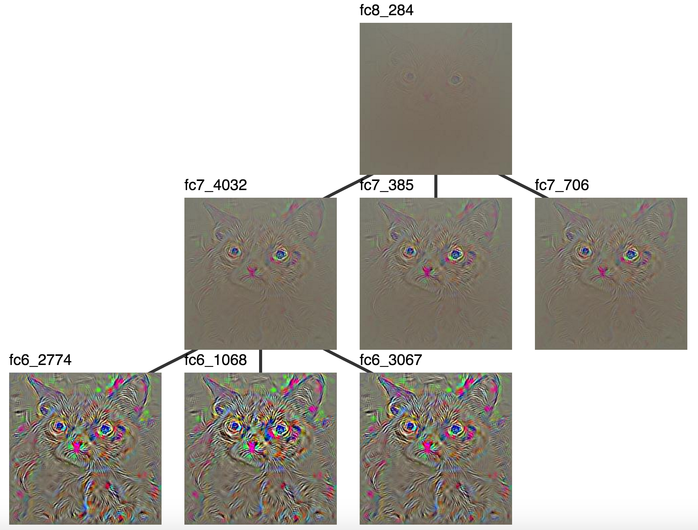{:.center}
<figcaption markdown="1">
The "Siamese cat" neuron (`fc8_284`) along with units that highly activated it in `fc7`
and units that highly activated `fc7_4032` in `fc6`.
</figcaption>
</figure>
{:.zoom_img}

Unfortunately, these don't seem very interpretable, probably because these
layers have no spatial resolution. That means we can't really relate classes
to pixels. However, the convolutional layers tell a different story. `conv5`
starts with high level interpretable features which we understand as cat
parts, so maybe we'll be able to almost relate ConvNet outputs to inputs.

The `conv5` visualizations rooted in `fc8` were
quite saturated, so let's start with a visualization rooted at `fc6_1068`.

{::comment}
interesting paths
fc8_284 -> fc7_1757 -> fc6_3354
fc8_284 -> fc7_4032 -> fc6_1068
{:/comment}

<figure markdown="1">
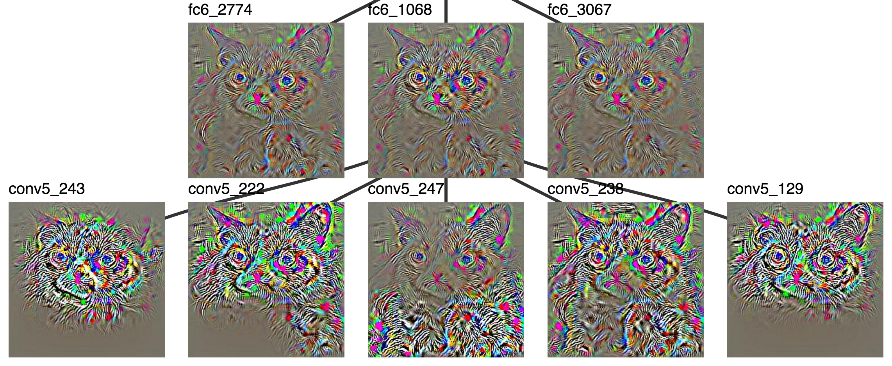{:.center}
<figcaption markdown="1">
A highly activated `fc6` unit and the `conv5` units which most contributed to it.
</figcaption>
</figure>
{:.zoom_img}

Some units in `conv5` are looking for faces. Some units are looking
for ears. The visualized units of `conv5` which contribute to `fc6_1068`
seem to look for different parts of the cat which happen to show up in
different locations.

It becomes easier to tell what's going on once the patch
visualizations are added, but it's hard to fit all 5 on the same
screen, so let's set aside two of them.
These are looking for wheels (they look like eyes) and generic animal faces (lots and lots of
conv5 activations look for some sort of animal face).

<figure markdown="1">
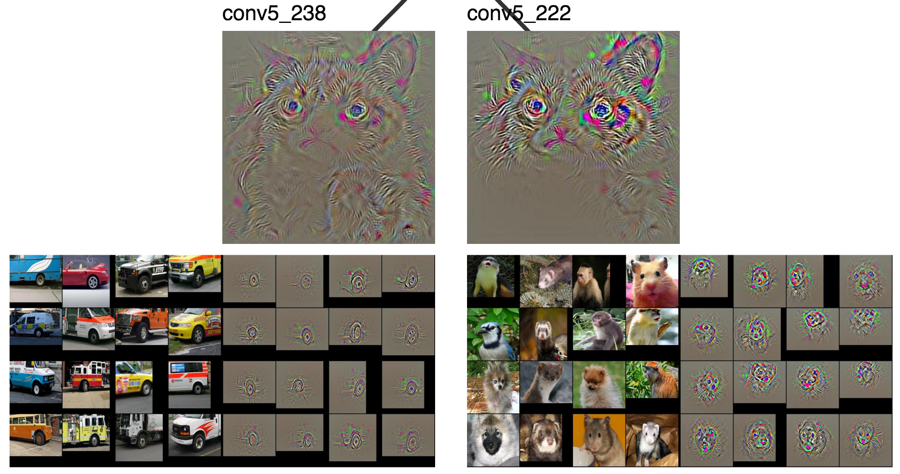{:.center}
<figcaption markdown="1">
</figcaption>
`conv5_238` and `conv5_222`
</figure>
{:.zoom_img}

Now we can focus on more interesting neurons.

<figure markdown="1">
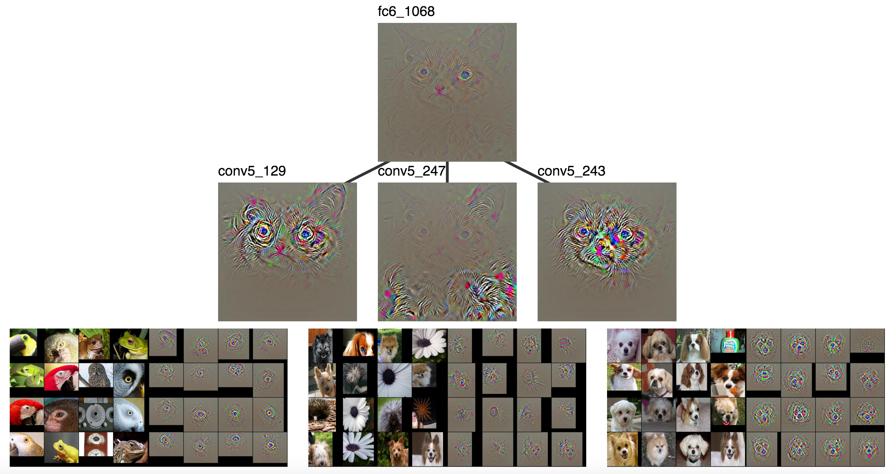
<figcaption markdown="1">
As shown previously, `conv5_129`, `conv5_247`, and `conv5_243`.
</figcaption>
</figure>
{:.zoom_img}

Clearly `conv5_129` is looking for eyes, `conv5_247` seems to be looking
at furry stuff, and `conv5_243` is looking for dog faces.
Those are high level categories that could clearly contribute
to classifying Grumpy Cat as a cat.

> furr + face + eye (perhaps tire) + ... = cat

Let's continue to `conv4` to see what makes up a dog face.
Again, we'll discard two neurons

<figure markdown="1">

<figcaption markdown="1">
`conv4_295` and `conv4_302`
</figcaption>
</figure>
{:.zoom_img}

and keep the rest.

<figure markdown="1">
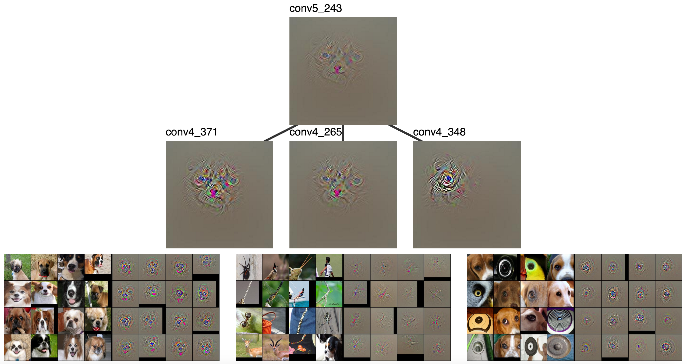
<figcaption markdown="1">
`conv4_371`, `conv4_265`, and `conv4_348`
</figcaption>
</figure>
{:.zoom_img}

There are lots face detectors (even in `conv4`!), some sort of pattern
that seems to find noses (`conv4_265`), and another eye detector.
I didn't try to find the redundant face and eye detectors, they
just seem to occur quite frequently. There's also a noticable difference in the amount
of complexity and context around the eyes and faces, with more complexity and
context in deeper layers.

> dog faces + nose + eye + ... = dog face

I'm still interested in faces, so let's look at `conv4_371`.
We'll throw out 2 neurons

<figure markdown="1">

<figcaption markdown="1">
`conv3_341` and `conv3_343`
</figcaption>
</figure>
{:.zoom_img}

and keep the rest.

<figure markdown="1">
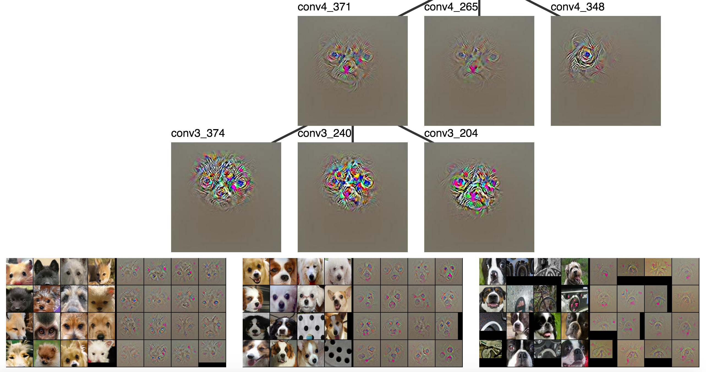
<figcaption markdown="1">
`conv3_374`, `conv3_240`, and `conv3_204`
</figcaption>
</figure>
{:.zoom_img}

We got rid of a simple eye detector and a vertical white line / face detectors and kept some more interesting features.
`conv3_374` looks for fur and eyes together, `conv3_240` looks for two eyes and a nose, and `conv3_204`
looks for a snout with a pink thing (tongue) underneath it.

> face + eye + `conv3_374` + `conv3_240` + `conv3_204` + ... = dog face

Clearly `conv3_374`, `conv3_240`, and `conv3_204` are somewhat well defined parts,
but it's hard to name them.

We'll continue with `conv3_240`.

<figure markdown="1">
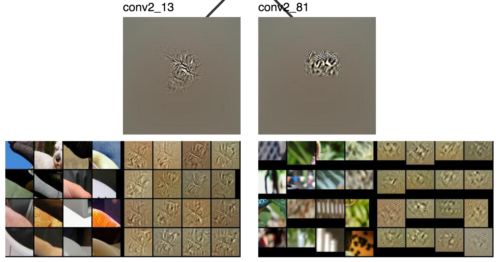
<figcaption markdown="1">
`conv2_13` and `conv2_81`
</figcaption>
</figure>
{:.zoom_img}

The left neuron (`conv2_13`) sort of looks like it activated
for the cat's cheek, but I can't quite tell what the right one does.
These are clearly lower level than `conv3`, where there was still
a simple eye detector and a simple face detector.

<figure markdown="1">
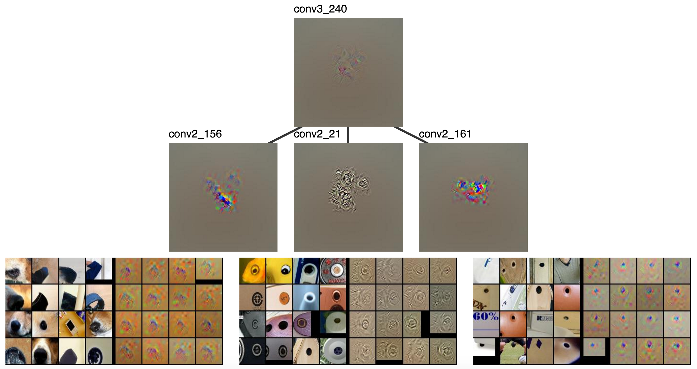
<figcaption markdown="1">
`conv2_156`, `conv2_21`, and `conv2_161`
</figcaption>
</figure>
{:.zoom_img}

I can see how `conv2_161` and `conv2_21` might be combined to create an eye detector
where the first looks for insides of eyes and the second looks for outlines. `conv2_156`
might also be used for noses, but it's not a very strong connection.

> dark black rectangular blob (nose) + circle outline (eye part 1) + small dot (eye part 2) + ... = 2 eyes + nose

Finally, we visualize `conv1`, which looks for straightforward motifs
that have been around for a while.

<figure markdown="1">
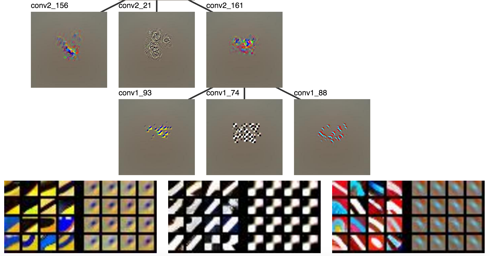
<figcaption markdown="1">
`conv1_93`, `conv1_74`, and `conv1_88`
</figcaption>
</figure>
{:.zoom_img}

> circular blob + black and white grid + colored edge + ... = small dot

The visualizations sort of answered why the CNN called the image a cat.
The concepts represented by a neuron's visualization and
that of its parent typically fit together well. You can see how one is
composed of the other. However, the visualizations, our capcity to understand
them, or the network breaks down at some point. The most prevelent observation
is the amount of redundancy between layers. For example, multiple layers seem to contain
more than one face detector. It's not clear whether 
the visualizations aren't good enough to distinguish between features that really aren't
redundant, the network learns redundant features, or whether the interpreters don't recognize the unique
portions of the visualizations.

Conclusion
---

In this post I explored how we understand ConvNets through visualization.
We tend to focus on individual neurons, but not how they relate to other neurons.
The latter part is essential because ConvNets are supposed work by learning to
compose complex features from simpler ones. The second part of the blog proposed a
way to combine existing visualizations in a way that relates units across layes
in a neural network.

{::comment}
The redundancy is much more prevelant with this method because redundant features
tend to simultaneously be top activations.
It may have been present before, though not noticable to the same degree

It would be nice if all the reconstruction patches were not pictures of dogs.
Visualizations of a CNN trained with more visually balanced classes
might help.

how to focus visualizations on fine grained classification?

I've been talking about how to understand images.

why redundancy? -- possibly because of the fine grained dog classes

* conclusion
    * talk about ways to know how a thing works... contrast intuitions and mathematical understanding... one preceeds the other
    * talk about being able to understand ConvNets vs being able to understand 
        * perhaps we understood HOG better, but somehow we can understand ConvNets better because it more closely maps to our visual system

One cool thing about ConvNets is that __there is complexity__ and we
can try to understand it, especially if we enlist the aid of human vision through visualization.
This is not at all the case for Deep Blue.
That program worked by approximately enumerating possible chess games
many moves away (there are lots, so this is hard) and applying some
algorithmic and heursitic tricks so it could enumerate fewer.
When humans play chess we mainly look for patterns and can make only
extremely limited progress trying to consider all possible future moves.

and it might even be close to how we understand the visual world (it discovers parts and we tried to describe the world in parts).

still don't know how to relate fc8 to fc6

Points to make / Questions to ask
---

* Why do we need to modify the backward step to get better visualizations?

* There might be other ways than the weight matrix method to relate
  neurons to eachother, also ways to relate sets of neurons.

* There are probably much better ways to visualize this information,
  but I just wanted to do a simple visualization here.

* Maybe we can begin to answer questions like
  "What makes this dog detector different from this other dog detector?"

* It's clear that the hierarchy of parts that makes up the eye detector
  decreases in "semantic complexity" from layer to layer; one layer
  is clearly simpler than the one above it.

* Is my cropping method similar to the "empirical recptive fields" of the
  emerging detectors paper?

* Note that I'm not (yet) talking about relating spatial location.

* Note that the software I wrote doesn't just have to consider weights
  between adjacent layers, it can weight any pair of layers (just using
  gradients from a fixed starting point).

* I need to make a point about how good examples drive new ideas. (cite Bostock's talk?...)

* Interface between conv5 and fc6

* point out that my description of a cat could also be a dog

* End by talking about how this is a qualitative intuitive understanding of the thing.
  That's the worst type of understanding for a scientist... we would like something
  quantitative, probably mathematical. However, often those things are inspired by
  qualitative understanding like visualizations can provide.

* At some point mention that the hierarchy of parts intuition is how neural net
  people always describe their models.

* It would be cool if someone took these concrete examples and was able to
  implement a vision system without learning.

* This allows us to look at patterns networks detect which we find very difficult
  to talk about and name.

P.S.: it comes with code (TODO)

TODO: thank yous

More Examples
---

Here are a couple more interesting relations.

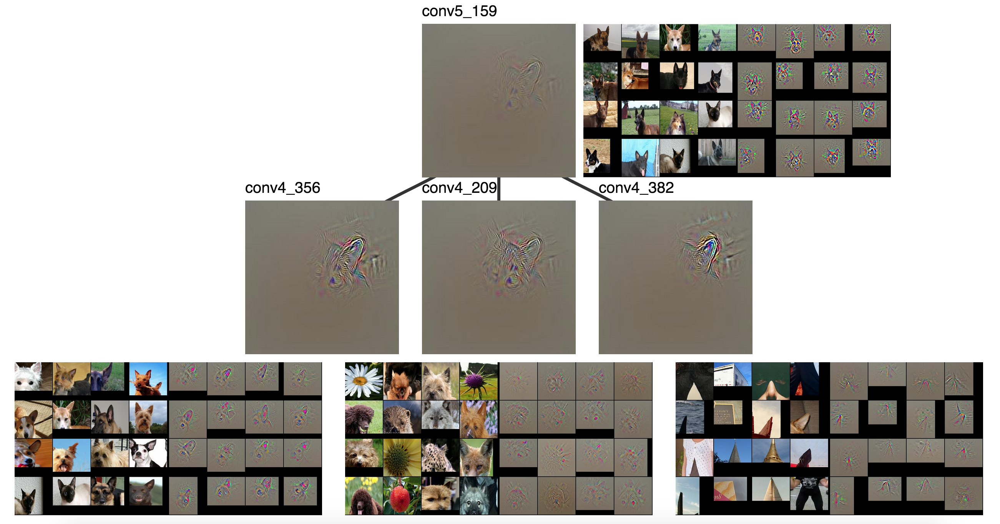
{:.zoom_img}

{:/comment}

[^nn_intro]:
    Andrej Karpathy's recent [blog](http://karpathy.github.io/2015/10/25/selfie/) is a blog length introduction
    ConvNets for a wide audience. Also see [this](https://www.youtube.com/watch?v=bHvf7Tagt18)
    introduction to Machine Learning and Deep Learning from Google.

    For more technical details on NNs and ConvNets, try Michael Neilsen's [book](http://neuralnetworksanddeeplearning.com/),
    Andrej Karpathy's code oriented [guide](http://karpathy.github.io/neuralnets/), or 
    one of Chris Olah's [blogs about ConvNets](http://colah.github.io/posts/2014-07-Conv-Nets-Modular/).
    Pat Winston also has a [lecture about neural networks](https://www.youtube.com/watch?v=q0pm3BrIUFo) in his
    intro Artificial Intelligence course.

    I learned the basics from Andrew Ng's Coursera [course](https://www.coursera.org/learn/machine-learning) on Machine Learning
    and Geoffrey Hinton's [course](https://www.coursera.org/course/neuralnets) that dives a bit deeper into Neural Networks.

[^nn_diagram]: This image comes from [chapter 1](http://neuralnetworksanddeeplearning.com/chap1.html) of
    Neural Networks and Deep Learning (Michael Neilsen's book).

[^categories]: Since the network was trained on the [ILSVRC classes](http://image-net.org/challenges/LSVRC/2014/browse-synsets)
    there are actually many subcategories for both dogs and cats.

[^winston_vision]: Pat Winston has a nice [video](https://www.youtube.com/watch?v=gvmfbePC2pc) about
    one such attempt to hard code an algorithm for vision.

[^other_vis]: You can find how some other cool

    You may also have heard of [Google's](http://googleresearch.blogspot.com/2015/06/inceptionism-going-deeper-into-neural.html)
    [DeepDream](https://www.reddit.com/r/deepdream/).
    This can be thought of as an image specific combination of the two
    ideas that does a sort of optimization starting from a real image,
    but meant to maximize a set of neurons instead of just one and applied to
    different layers instead of just the output layer.

    Another cool visualization tool is Jason Yosinski's [deepvis](http://yosinski.com/deepvis),
    which uses a lot of the aforementioned techniques in one visualization tool.

[^not_parcoord]: It looks like [parallel coordinates](https://syntagmatic.github.io/parallel-coordinates/),
    but it's not really. The axes correspond layers of a CNN and the values on
    each axis correspond to individual neurons. Placing neurons on an axis implies
    an order (e.g., neuron 5 is greater than neuron 88), but no such ordering of
    neurons in the same layer exists.

[^saturate]: This tends to saturate visualizations, especially as they
    grow further from the root activation. I couldn't find simple rule that consistently
    prevented saturating, but I found the saturated versions still work work well enough.
    Let me know if you come up with something.

{::comment}

Examples
---
TODO: include examples of other types of things
license plate and text detection
http://werbos.ece.vt.edu:5000/vis/COCO_train2014_000000359320.jpg?blob_name=conv5&act_id=243

detected tree as legs in elephant picture
http://werbos.ece.vt.edu:5000/vis/ILSVRC2012_val_00033331.JPEG?blob_name=conv5&act_id=169

cat pointy ear conv5 blob
http://werbos.ece.vt.edu:5000/vis/cat.jpg?blob_name=conv5&act_id=159
conv5_159 -> conv4_356 -> conv3_228 (upper left ear) and conv3_227 (lower right ear)
{:/comment}

{::options parse_block_html="true" /}
