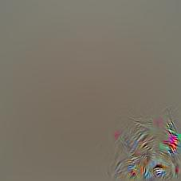

Hierarchies of Parts in Convolutional Neural Networks
===

{::comment}
* include some question like "why is this a cat?"
    * this just shows that CNNs
    * however... it is a good attention getter
This post asks that question for CNNs.
{:/comment}

Try to answer this question:

> Why do you think this is a cat?

<figure markdown="1">
{:.center}
</figure>

In other words: "How do you see?"
Actually, I'm not so interested in how _you_ see, but rather how
_computers_ see, cause they've gotten a lot better at doing that.
For those coming to this blog who don't know, Convolutional Neural
Networks are the models that have allowed computers to do reasonably
well at a wide variety of visual tasks and we're still trying to understand how they do it.
There are a couple intuitions about how CNNs work, but it's hard
to find good examples for some of them, so I'll try to do that
using some cool visualization techniques.

{::comment}
* about CNNs (short)
    * the really important thing to understand at a high level is layers of transformation and nodes at each layer
* explain the ZF visualizations and the extension by the striving for simplicity paper
{:/comment}

(Convolutional) Neural Networks -- Building Layers of Patterns
---

I don't intend to teach you how to implement Neural Networks (NNs) or Convolutional Neural
Networks (CNNs). Others have done quite a good job of that in a variety of
formats and to varying depths[^nn_intro]. However, I'll try to introduce the
important concepts as I go along. I'll also get in to some detail, but I hope
you can still understand the high points without it.

Though they've been around [since the '80s](https://en.wikipedia.org/wiki/Convolutional_neural_network#History),
CNNs became really popular after faster computers and more data allowed them to win the ImageNet
Large Scale Visual Recognition Challenge in 2012.
Since then, this type of model has gone from obscure to a fundamental part of Computer Vision.
We've discovered they're pretty good at a lot more than telling you that an image contains a cat.

To predict the content of images, CNNs transform an inputs image (the cat image)
in multiple steps, represented as layers. The first layer, the input, corresponds to image pixels
and the last layer, the output, has one number for each thing the image might contain (here, the
1000 classes from the ILSVRC 2012 classes).
Each layer looks for patterns in its input, transforming them into new outputs
where higher layers look for more complex patterns until the final layer produces
outputs that correspond to whatever you're interested in (i.e., it labels the image a cat).

A useful way to think of a neural network is in terms of the nodes that are looking for patterns.
Below is a network with 4 layers, each containing some nodes (though the input nodes aren't
shown). The first layer is the input (left, layer 0, 5 nodes) and the last is the output (right, layer 3, 1 node).
The first hidden (middle) layer contains 3 nodes and the 2nd has 4. Each of the nodes
is connected to all the nodes in the previous layer because it's searching for patterns in
those nodes.

<figure markdown="1">
{:.center}
<figcaption markdown="1">
A simple Neural Network with 4 layers (including input and output).[^nn_diagram]
</figcaption>
</figure>

In normal neural networks each node corresponds to a single number, but
in CNNs the nodes are images. The network we'll be using (AlexNet) has
9 layers (0 through 8) and each layer has hundreds of nodes. This scale
(many layers, many nodes) is important for understanding images well.

Something we Could Understand
---

Crucially, the patterns in these systems are learned from examples.
I show the system hundreds of thousands of cats, dogs,
boats, birds, etc. and adjust the patterns seen by each neuron
so that the last layer produces high activation only for the cat neuron
when it sees a cat and high activation only for the dog neuron only
when it sees a dog[^categories]. In one sense I understand exactly
how the CNN works because I can implement it in code and train it
to make good predictions. In another sense I have no idea
how the thing works because I don't know what patterns it's looking for.

An interesting thing about CNNs is that there are even small parts
we might be able to understand in the first place.
Consider [Deep Blue](https://en.wikipedia.org/wiki/Deep_Blue_(chess_computer)),
IBM's program which famously beat the reigning world champion at chess.
At some point a team of programmers coded the thing up, so they clearly know
[how Deep Blue works](http://stanford.edu/~cpiech/cs221/apps/deepBlue.html).
However, a similar problem to the CNN problem appears. If you ask one of
the programmers to tell you why the machine made a particular move
she can't tell you in a way that makes any sense to even the most seasoned chess player.

The thing is, there aren't any components like the neurons in a CNN which
we might be able to understand. When asked to make a move Deep Blue searches
through all possible future moves and has some rules to help it pick
the best. There are a few nice algorithmic tricks and well chosen rules
that allowed it to perform as well as it did, but _it didn't discover any patterns_
that might help us intuitively understand how it plays chess.

On the other hand, humans can describe how they play chess. Lots of books
have been written on the topic. 
We can describe how we play chess, but not how computers do it.
But can we describe how we see?
Now is a good time to try and answer the question I started with, which is repeated here:

> Why do you think this is a cat?

<figure markdown="1">
{:.center}
</figure>

Here's my answer:

> The thing in the center has __eyes__, a __flat, pink nose__, and a __small mouth__.
> It also has __pointy ears__ which compose with the previous features
> to form a __head__ with __ears on top__ and __mouth on the bottom__.
> Furthermore, it has __whiskers__, and is quite __furry__.
> Its expression is amusing, but has little to do with it being a cat.

That's good, but the only direct input I have is light from my eyes.
I don't have an ear sense, a furry sense, or a mouth sense. I have
to process light to figure out that ears, fur, and a mouth are present.
If you're tired of cats then you might also wonder about the visual
elements of a [chair](http://arxiv.org/abs/1411.5928).
Perhaps I can describe each of these parts in further detail
until I can recursively describe each part in terms of the input.
Evidence suggests this is at least _very hard_. Decades of research
which tries to do this, and test it by implementing the resulting description in a computer,
have failed to produce very good results[^winston_vision].

Now let's try to describe how CNNs see.

Visualizing the Layers
---

Especially since the ILSVRC challenge in 2012, lots of methods have been
proposed to understand the patterns learned by CNNs.

If it's looking for a cat's ear then
one of those feature maps might look something like this[^2]:

{:.center}

Otherwise the feature maps are mostly blank.

This is satisfying because it contrasts with past techniques. Instead
of having CV specialists specify how to get information from pixels,
CNNs learn how pixels relate to higher level concepts automatically.
We just need to show them examples and they learn how to relate
pixels to cats.

Crucially, this happens in a series of steps, not just one.
Each step takes some images and transforms them in to
new images that are mostly blank, except in areas that contain
visual patterns the CNN is looking for (out of, say, 100s of patterns).
After a series of these transformations, something like the following pops out:

TODO: show cat part visualizations

TODO: tell them I was lying about what the feature maps look like

stuff stuff stuff

{::comment}
* describe why CNNs are not well understood
{:/comment}

{::comment}
* explain the problem with non-relational node-wise visualizations
{:/comment}

What the Visualizations don't say
---

There have been many approaches to visualizing CNNs, but they all focus
on the same question:

> What do a particular set of neurons mean in image space?

Deep neural networks are supposed to learn high level information,
so this is a good question to ask.
To some degree, visualizations have been able to answer this question.
They can sometimes confirm that particular neurons or sets of neurons
consistently respond to concepts like "dog's" head and not so much to
other concepts[^2]. Here's another (ill posed) question we might be
interested in answering:

> Why is this a cat?

Activation based visualizations will say this is a cat because the
neuron whose visualization looks like a pointy ear fired. And the
neuron which sees furry things fired and so did the neuron that
detects paws. But why did those neurons fire?
Clearly we know that certain

* The question "Why is this a cat?" is just asking why a particular
  neuron's activation is high. We can also ask why other neurons
  have high activation ("Why is this a cat's eye?"). We can't answer
  similar the questions for these other neurons in the same manner
  as we answered the first question because there aren't any
  labeled lower level neurons.

* Perhaps the cat (TODO: better example; bus/car?) is only a cat because of context.
  Again, this is great to know, but it breaks down between gabor filters (conv1)
  and cat faces (conv4/conv5).
  Could connection visualizations help reveal this?

* Neuron visualizations don't give a sense of compositionality. How is layer l
  activation computed from layer l-1 activation.

* We don't really understand middle layers of neurons because we have nothing
  to relate them to. We can relate them to the higher and lower layers
  of visualizations, so perhaps by doing so we'll be able to understand them.

{::comment}
* explain my extension of the ZF visualization
    1. connect neurons in adjacent layers in the visualization
    2. visualize paths of neurons
{:/comment}

How can we get them to say that?
---

{::comment}
* demonstrate how cnn representations break down in to parts
    * 2-3 full examples?
{:/comment}

More Examples
---

{::comment}
* conclusion
    * talk about ways to know how a thing works... contrast intuitions and mathematical understanding... one preceeds the other
    * talk about being able to understand CNNs vs being able to understand 
        * perhaps we understood HOG better, but somehow we can understand CNNs better because it more closely maps to our visual system
{:/comment}

Conclusion
---

* conclusion
    * talk about ways to know how a thing works... contrast intuitions and mathematical understanding... one preceeds the other
    * talk about being able to understand CNNs vs being able to understand 
        * perhaps we understood HOG better, but somehow we can understand CNNs better because it more closely maps to our visual system

... the cool thing about CNNs is that __there is complexity__, we may be able
to understand that complexity if we enlist the aid of our visual senses,
and it might even be close to how we understand the visual world (it discovers parts and we tried to describe the world in parts).
This is not at all the case for Deep Blue.
That program worked by approximately enumerating possible chess games
many moves away (there are lots, so this is hard) and applying some
algorithmic and heursitic tricks so it could enumerate fewer.
When humans play chess we mainly look for patterns and can make only
extremely limited progress trying to consider all possible future moves.

[^nn_intro]: Michael Neilsen's [book](http://neuralnetworksanddeeplearning.com/) is a good starting point for learning how
    Neural Networks work, as is Andrej Karpathy's code oriented [guide](http://karpathy.github.io/neuralnets/).
    Pat Winston does an excellent [lecture](https://www.youtube.com/watch?v=q0pm3BrIUFo) in his intro Artificial Intelligence course.

    Karpath's recent [blog](http://karpathy.github.io/2015/10/25/selfie/) has a nice, short CNN intro toward the beginning.
    Chris Olah does a nice job introducing Convolutional Neural Networks in his [blog](http://colah.github.io/posts/2014-07-Conv-Nets-Modular/).

    I learned the basics from Andrew Ng's Coursera [course](https://www.coursera.org/learn/machine-learning) on Machine Learning
    and Geoffrey Hinton's [course](https://www.coursera.org/course/neuralnets) that dives a bit deeper into Neural Networks.

    {::comment}
    TODO: also, [this](https://www.youtube.com/watch?v=bHvf7Tagt18)
    {:/comment}

[^nn_diagram]: This image comes from [chapter 1](http://neuralnetworksanddeeplearning.com/chap1.html) of
Neural Networks and Deep Learning (Michael Neilsen's book).

[^categories]: Since the network was trained on the [ILSVRC classes](http://image-net.org/challenges/LSVRC/2014/browse-synsets)
there are actually many subcategories for both dogs and cats.

[^winston_vision]: Pat Winston has a nice [video](https://www.youtube.com/watch?v=gvmfbePC2pc) which describes
one such method seeing (also part of his Artificial Intelligence course).

Notes
===

TODO: put picture of cat

Done? Excellent! Here's what I said:

> This picture has some pointy ears. They're triangle shaped on the top and the
> outline has a furry look to it. Below the ears are a pair of eyes.
> TODO: finish

Your description probably 

Lot's of ideas have been

It's just something everyone with working eyes does. 

Pause and take a moment to think about your answer.
Here's mine:

Points to make / Questions to ask
---

* Why do we need to modify the backward step to get better visualizations?

* There might be other ways than the weight matrix method to relate
  neurons to eachother, also ways to relate sets of neurons.

* There are probably much better ways to visualize this information,
  but I just wanted to do a simple visualization here.

* Maybe we can begin to answer questions like
  "What makes this dog detector different from this other dog detector?"

* It's clear that the hierarchy of parts that makes up the eye detector
  decreases in "semantic complexity" from layer to layer; one layer
  is clearly simpler than the one above it.

* Is my cropping method similar to the "empirical recptive fields" of the
  emerging detectors paper?

* Note that I'm not (yet) talking about relating spatial location.

* Note that the software I wrote doesn't just have to consider weights
  between adjacent layers, it can weight any pair of layers (just using
  gradients from a fixed starting point).

* I need to make a point about how good examples drive new ideas. (cite Bostock's talk?...)

* Interface between conv5 and fc6

* point out that my description of a cat could also be a dog

* End by talking about how this is a qualitative intuitive understanding of the thing.
  That's the worst type of understanding for a scientist... we would like something
  quantitative, probably mathematical. However, often those things are inspired by
  qualitative understanding like visualizations can provide.

* At some point mention that the hierarchy of parts intuition is how neural net
  people always describe their models.

* It would be cool if someone took these concrete examples and was able to
  implement a vision system without learning.

Examples
---

license plate and text detection
http://werbos.ece.vt.edu:5000/vis/COCO_train2014_000000359320.jpg?blob_name=conv5&act_id=243

detected tree as legs in elephant picture
http://werbos.ece.vt.edu:5000/vis/ILSVRC2012_val_00033331.JPEG?blob_name=conv5&act_id=169

cat pointy ear conv5 blob
http://werbos.ece.vt.edu:5000/vis/cat.jpg?blob_name=conv5&act_id=159
conv5_159 -> conv4_356 -> conv3_228 (upper left ear) and conv3_227 (lower right ear)

{: .overflow_center }

{: .overflow_center }

[^1]: See [this](http://colah.github.io/posts/2014-07-Conv-Nets-Modular/) nice introduction by Chris Olah 

[^2]: emerging object detectors (TODO)

[^AlexNet]: [AlexNet](http://www.cs.toronto.edu/~fritz/absps/imagenet.pdf)

{::options parse_block_html="true" /}
