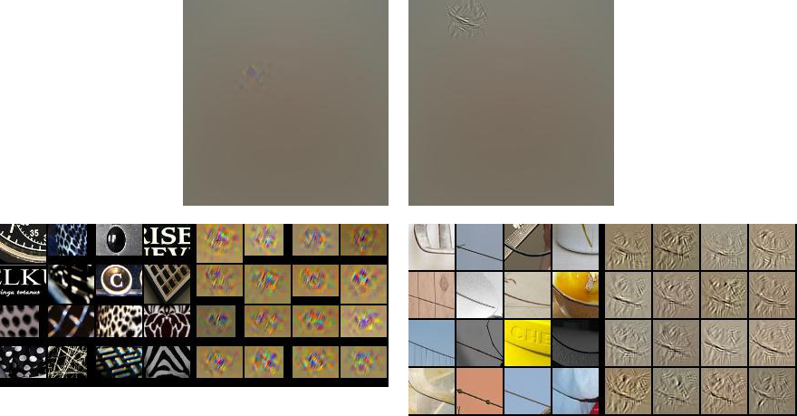

Why is this a cat?
===

<figure markdown="1">
{:.center}
</figure>

In other words, "How do you recognize this cat?".
Actually, I'm not so interested in how _you_ see, but rather how
_computers_ see, because they've gotten a lot better at seeing
and we don't fully understand how they do it.
For those coming to this blog who don't know, Convolutional Neural
Networks are the models that have allowed computers to do reasonably
well at a wide variety of visual tasks.
There are some intuitions about how ConvNets work, but it can be hard
to find examples of them. This post is part 1 of 2.
Now I'll tell you about Convolutional Neural Networks, some work others
have done to gain intuition about them, and some opportunities these
approaches miss. The next post will introduce
a new visualization technique to help gain more intuition.

(Convolutional) Neural Networks -- Building Layers of Patterns
---

Others have done quite a good job of introducing Neural Networks (NNs) and Convolution Neural Networks (ConvNets),
so I won't spend much time on that.
You can find a variety of pointers in the footnote at the end of this sentence[^nn_intro].
I'll still try to introduce the
important concepts for this blog as I go along.

Though they've been around [since the '80s](https://en.wikipedia.org/wiki/Convolutional_neural_network#History),
ConvNets became really popular after faster computers and more data allowed them to win the ImageNet
Large Scale Visual Recognition Challenge in 2012[^ilsvrc2012].
Since then, this type of model has been raised from obscurity to become a fundamental part of Computer Vision.
We've discovered they're pretty good at a lot more than telling you an image contains a cat.

ConvNets work by transforming an input (the cat image)
in multiple steps or layers. The first layer, the input, corresponds to image pixels
and the last layer, the output, has one number for each object class the image might contain (here, the
1000 [classes from the ILSVRC 2012 challenge](http://image-net.org/challenges/LSVRC/2014/browse-synsets)).
Each layer looks for patterns in its input, transforming them into new outputs
where higher layers look for more complex patterns until the final layer produces
outputs that correspond to whatever you're interested in (i.e., it labels the image a cat).

A useful way to think of a neural network in terms of the nodes -- called units or neurons --
which look for or trying to detect patterns.
Below is a network with 4 layers, each containing some nodes (though the input nodes aren't
shown). On the left is the input with 5 nodes and on the right is the output with 1 node.
The first hidden (middle) layer contains 3 nodes and the 2nd has 4.

<figure markdown="1">
{:.center}
<figcaption markdown="1">
A simple Neural Network with 4 layers (including input and output).[^nn_diagram]
</figcaption>
</figure>

In normal neural networks each unit corresponds to a single number, but
in ConvNets they correspond to images. The network we'll be using (AlexNet) has
9 layers (0 through 8) and each layer has hundreds of neurons. This scale
(many layers, many neurons) is important for understanding images well.

The important bit for this article is the connections between units.
Each unit is connected to all the
units in the previous layer because it's searching for patterns in those units.
Since there are layers of these, deeper (toward the output) units are
looking at patterns of patterns of patterns....
so each unit depends on the ones that came before it in a hierarchical fashion.
The __hierarchies of neurons__ allow efficient
representation of complex patterns in terms of simpler patterns.

Something we Don't Know
---

Crucially, the patterns in these systems are learned from examples,
and this is where our understanding of the system starts to fail.
To train a ConvNet, we show it hundreds of thousands of cats, dogs,
boats, birds, etc. and adjust the patterns seen by neurons at all layers
so that the last layer says cat when the image contains a cat and not otherwise[^categories].
This ability to get a working system
from only a vague specification makes the model possible, humans
couldn't manually specify all the patterns, but it
also means we sacrifice some understanding.
In one sense I understand exactly
how the CNNs work because I can implement them in code and they
make good predictions once trained.
In another sense I have no idea
how the things work because __I don't know what patterns they're looking for__.

An interesting thing about ConvNets is that there are even small bits
we might be able to understand in the first place.
Consider [Deep Blue](https://en.wikipedia.org/wiki/Deep_Blue_(chess_computer)),
IBM's program which famously beat the reigning world champion at chess.
At some point a team of programmers coded the thing up, so they clearly know
[how Deep Blue works](http://stanford.edu/~cpiech/cs221/apps/deepBlue.html).
However, a similar problem to the CNN problem appears. If you ask one of
the programmers to tell you why the machine made a particular move
she can't tell you in a way that fits into the understanding of
even the most seasoned chess player.

There aren't any patterns to understand. When asked
to make a move, Deep Blue searches
through all possible future moves and has some rules to help it pick
the best. There are a few nice algorithmic tricks and well chosen rules
that allowed it to perform as well as it did, but the method doesn't
fit into any human framework of understanding.

On the other hand, humans can describe, and even teach how they play chess.
It's harder to describe how we see.

> Why is this a cat?

<figure markdown="1">
{:.center}
</figure>

Here's my answer:

> The thing in the center has __eyes__, a __flat, pink nose__, and a __small mouth__.
> It also has __pointy ears__ which compose with the previous features
> to form a __head__ with __ears on top__ and __mouth on the bottom__.
> Furthermore, it has __whiskers__, and is quite __furry__.
> Its expression is amusing, but has little to do with it being a cat.

That's a start, but it isn't precise enough.
I can't use it to write an algorithm that sees because
the description isn't in terms of any useful input.
I don't (nor do computers) have a furry sense, an ear sense, or a mouth
sense -- that's what vision gives me --
yet I described what I see in terms of those fundamental components.
It would be useful if I could recursively describe each of these
parts in further detail until each complex visual pattern is __detailed in terms of the input__.

Evidence suggests this is at least _very hard_. Computer Vision is the name
of the field which has been trying to do it for decades. Come up with a candidate description,
test it by implementing it on a computer, fail, repeat[^winston_vision].

However, ConvNets seem to be able to do it, so let's try to understand them.

Visualizing Individual Units
---

Especially since the ILSVRC challenge in 2012, lots of methods have been
proposed to understand the patterns learned by ConvNets.
The kind of understanding I'm interested in is an intuitive understanding
of why a ConvNet makes a particular choice. It's hard to describe how we
see in words, so it might seem even more futile for ConvNets.
However, our precise computational understanding of ConvNets allows us
to generate images with certain specific meanings. Fortunately, our visual
system can often understand these visualizations and thereby
understand something about ConvNets.

The next part gets researchy, so you can skip it if you get lost.
All you need to know is that we can generate images which highlight
the pixels a particular neuron cares about so that changing those
pixels in the original image would greatly effect the neuron's activation,
but changing other pixels wouldn't have such a great effect.
That's how these visualizations relate neurons to pixel space.
Make sure you visit the [examples](#examples) section to get an
idea of what the visualizations mean, because that's the next step.

### Ways to Visualize ConvNets

So far we have two ways to generate visualizations:

1. __Optimization in Image Space__ (uses gradients)

    Training a CNN is just adjusting the _patterns_ (free variables) neurons look for
    in _images_ (fixed variables) so the neurons become more and more likely to
    associate the patterns of a cat image with the label "cat".
    Instead, this visualization method leaves _patterns_ alone (fixed variables)
    and adjusts _images_ (free variables) so the neurons are more and more likely to see the patterns
    they want to call "cat".
    Note that these methods start with a blank image and optimize from there instead
    of starting with a real image and perturbing it, so these techniques are
    __not image specific__. They simply ask "What image would the CNN like to see?"
    {::comment}
    (TODO: Is it just adversarial examples when you start with an image?)
    {:/comment}

    Simonyan, Vedaldi, and Zisserman have done some [nice work](http://arxiv.org/abs/1312.6034)
    with this method, as have [Mahendran and Vedaldi](http://arxiv.org/abs/1412.0035).
    Some earlier work was done by [Erhan et. al.](http://www.iro.umontreal.ca/~lisa/publications2/index.php/attachments/single/207)
    Here's a visualization which was generated to maximize the a flamingo recognizing neuron using
    this method. You can clearly see "flamingo elements". I wouldn't call the thing
    a flamingo, but our ConvNet would.

    <figure markdown="1">
    {:.center}{: style="width: 50%"}
    <figcaption markdown="1">
    From figure 8 of [[Mahendran and Vedaldi](http://arxiv.org/abs/1412.0035)].
    </figcaption>
    </figure>

2. __Gradients__ (just gradients, sort of)

    Another technique tries to show how changing certain pixels
    will change a desired neuron (again, e.g., a neuron trained to recognize cats)
    That is, it just visualizes the gradient
    of a particular neuron with respect to the image. This
    technique __is image specific__. It asks "Which pixels in this one particular
    picture made the cat activation high?"

    Actually, I lied. Visualizing the pure image gradients generates is not very satisfying,
    as shown in Simonyan, Vedaldi, and Zisserman [paper](http://arxiv.org/abs/1312.6034).
    Zeiler and Fergus created a "deconv" visualization which is mathematically similar to the gradient image,
    except it uses a slightly different function to compute the backward pass of the
    ReLU, so it can't be called a gradient (explained in [Simonyan, Vedaldi, and Zisserman](http://arxiv.org/abs/1312.6034)
    and quite clearly in the [guided backprop paper](http://arxiv.org/abs/1412.6806)).

    [Deconv visualizations](http://arxiv.org/abs/1311.2901) by Zeiler and Fergus were the first to figure out this method.
    A more [recent extension](http://arxiv.org/abs/1412.6806) by Springenberg, Dosovitskiy, Brox, and Riedmiller
    is called guided bakprop. It refines the idea and makes it work for fully connected
    layers (at least those in AlexNet) by adding another restriction to
    the backward pass of the ReLU unit (again, their paper has an excellent explanation).
    In contrast to the first type of visualization, these methods focus on intermediate layers
    and individual neurons rather than output layers and the ConvNet as a whole.

Note that the second method allows questions about __specific images__
and __specific neurons__, which is good since I want to find out how a
specific cat is recognized. Because it works for fully connected layers
and I find the visualizations crisper, we'll use guided backprop.
There are some other cool techniques you can read about in the
footnote at the end of this sentence[^other_vis].

### Examples

Now let's use guided backprop to visualize a couple neurons in different layers.
Here are visualizations of neurons 4 and 65 from
layer `conv1` (after the ReLU, but not after pooling):

<figure markdown="1">
{:.center}
<figcaption markdown="1">
`conv1_4` and `conv1_65`
</figcaption>
</figure>
{:.zoom_img}

The top of each side contains one of the "gradient" images the
method produces, which means that changing the non-gray pixels
in the original image will likely raise the activation of the corresponding neuron (`conv1_4` or `conv_65`).
It's sometimes hard to determine exactly what semantic feature
of the highlighted pixels the CNN
responds to, so the bottom images help with that. The right sides of these images
show "gradient" patches from other images which highly activate the same neuron
(black diagonals and red blobs).
The left sides show the same patches cropped from the original images.
As some readers probably already know, `conv1` learns to look for
simple features which are easy to relate to pixels -- e.g., oriented edges and colored blobs.

If you're familiar with the type 2 visualizations from previous section then
you might wonder why these visualizations are much larger and mostly gray.
Typically the non-gray section is cropped out of the gray because the gray sections
have 0 gradient and are uninformative, as in the bottom part of the visualization.
To be consistent with future visualizations I left the whole image intact, which means it's mostly
gray and insignificant, but location information is preserved.

<figure markdown="1">
{:.center}
<figcaption markdown="1">
`conv2_174` and `conv2_69`
</figcaption>
</figure>
{:.zoom_img}

`conv2` is a bit less straightforward to understand than `conv1`.
It's hard to say what the neuron on the left seems to be looking for.
Perhaps it's a black or white background with some sort of clutter from
the other color. I don't see how such a pattern could contribute to recognition of ILSVRC
object classes because I can't imagine it (whatever it is) appearing very often.
It's also hard to find a rule that directly relates it to image pixels,
but none of this necessarily means the neuron is useless. Unit 69 is clearly looking for mostly horizontal
lines that go up slightly to the left. It's nice that the unit is invariant to
context (shower tiles, arm band, bowl), and I recognize that this sort of line
might appear in a variety of objects, but I still have trouble relating it to
object classes and I'm not sure how the fuzzy bits around the line in the gradient
images relate to pixels.

<figure markdown="1">
{:.center}
<figcaption markdown="1">
`conv5_137` and `conv4_269`
</figcaption>
</figure>
{:.zoom_img}

Deeper layers capture more abstract concepts like the beak
of a bird (`conv5_137`), which also activates highly
in response to Grumpy Cat's nose. Certain features like `conv4_269`
respond to specific patterns which are clearly at a larger scale
than `conv1` or `conv2`, but it's hard to identify
exactly how they might be useful. It's hard to come up with a rule to
extract either pattern from pixels.

What the Visualizations Don't Say
---

In each example it was easy to understand the neurons in input/pixel space (e.g., `conv1_4` is an edge filter),
easy to understand the neurons in output space (e.g., `conv5_137` should probably fire for birds), or
it was hard to understand the neurons in either space (e.g., `conv2_174`).
These visualizations are nice, but the inability to understand any neuron in terms of both input _and_ output
prevents us from understand ConvNets see, how they connect input to output.
To be more specific,

1. These visualizations _can_ sometimes confirm (qualitatively) that particular neurons
   select for concepts humans can label or for concepts that humans can connect directly to pixel space [^emerging].

2. The first interpretation is limited to certain high level neurons.
   We can see that middle layers of neurons might be useful, but we don't
   really know why. They need to be related in specific ways to either
   the gabor filters (oriented edge detectors) or the high level object
   parts, but we can't intuit those ways.

3. Even though we can relate some things in specific ways (e.g., a head should have an ear)
   we don't know for sure that the CNN is doing that (though it's a pretty reasonable guess :).
   However, it could also be relating unknown parts in strange or (if you want to go that far) unwanted ways.
   These visualizations don't say that the head is made up of pointy ears, a pink nose, whiskers, etc.
   We might know what things make up a head, but what is `conv2_174` a part of?

These missing relationships are a fundamental part of ConvNets.
They learn __hierarchies of features__.
Of course hierarchies are graphs that have both nodes _and_ edges, so
to understand hierarchies we need to talk about the edges[^drawnet].

Conclusion
---

In this post I started to explore how we understand ConvNets through visualization.
Current techniques focus on individual neurons and allow to analyze patterns a CNN
recognizes, but they don't show how those patterns relate one another.
The latter part is essential because ConvNets are supposed work by
composing more complex patterns out of simpler ones.
I'll try to investigate the edges in my next post.

---

[^ilsvrc2012]: The [ImageNet Large Scale Visual Recognition Challenge](http://www.image-net.org/challenges/LSVRC/2012/)
    is a competition between image classification models. Each entrant model is supposed to label objects in images
    by picking its class from 1000 possible classes. The dataset that comes with the challenge
    because of its scale; it has _millions_ of labeled images.

[^nn_intro]:
    Andrej Karpathy's recent [blog](http://karpathy.github.io/2015/10/25/selfie/) is a blog length introduction
    ConvNets for a wide audience. Also see [this](https://www.youtube.com/watch?v=bHvf7Tagt18)
    introduction to Machine Learning and Deep Learning from Google.

    For more technical details on NNs and ConvNets, try Michael Neilsen's [book](http://neuralnetworksanddeeplearning.com/),
    Andrej Karpathy's code oriented [guide](http://karpathy.github.io/neuralnets/), or 
    one of Chris Olah's [blogs about ConvNets](http://colah.github.io/posts/2014-07-Conv-Nets-Modular/).
    Pat Winston also has a [lecture about neural networks](https://www.youtube.com/watch?v=q0pm3BrIUFo) in his
    intro Artificial Intelligence course.

    I learned the basics from Andrew Ng's Coursera [course](https://www.coursera.org/learn/machine-learning) on Machine Learning
    and Geoffrey Hinton's [course](https://www.coursera.org/course/neuralnets) that dives a bit deeper into Neural Networks.

[^nn_diagram]: This image comes from [chapter 1](http://neuralnetworksanddeeplearning.com/chap1.html) of
    [Neural Networks and Deep Learning](http://neuralnetworksanddeeplearning.com/).

[^categories]: Since the network was trained on the [ILSVRC classes](http://image-net.org/challenges/LSVRC/2014/browse-synsets)
    there are actually many subcategories for both dogs and cats.

[^winston_vision]: Pat Winston has a nice [video](https://www.youtube.com/watch?v=gvmfbePC2pc) about
    one such attempt to hard code an algorithm for vision.

[^other_vis]: You may also have heard of [Google's](http://googleresearch.blogspot.com/2015/06/inceptionism-going-deeper-into-neural.html)
    [DeepDream](https://en.wikipedia.org/wiki/DeepDream).
    This can be thought of as an image specific combination of the two
    ideas that does a sort of optimization starting from a real image,
    but meant to maximize (the norm of) a set of neurons instead of just one, and applied to
    different layers instead of just the output layer.

    Another cool visualization tool is Jason Yosinski's [deepvis](http://yosinski.com/deepvis),
    which uses a lot of the aforementioned techniques in one application.

[^emerging]: To see a quantitative analysis of the phenomenan, see this [paper](http://arxiv.org/abs/1412.6856)
    about how certain neurons learn to behave like object detectors without being directly taught.

[^drawnet]: The one thing I know which does this
    is [DrawNet](http://people.csail.mit.edu/torralba/research/drawCNN/drawNet.html),
    from Antonio Torralba at MIT. This is a really neat visualization, which you should
    go check out (though perhaps later ;). It uses the empirical receptive fields from [this paper](http://arxiv.org/abs/1412.6856)
    about emerging object detectors along with a visualization that connects individual
    neurons that depend heavily on each other[^not_parcoord].
    However, it's still not image specific, so it can only say how a ConvNet
    would like to relate some parts to others without even knowing which neurons
    are likely to fire together.

    Interestingly, this visualization looks like [parallel coordinates](https://syntagmatic.github.io/parallel-coordinates/),
    but it's not really. The axes correspond to layers of a CNN and the values along
    each axis correspond to individual neurons. Placing neurons on an axis implies
    an order (e.g., neuron 5 is greater than neuron 88), but no such ordering of
    neurons in the same layer exists.

{::options parse_block_html="true" /}
